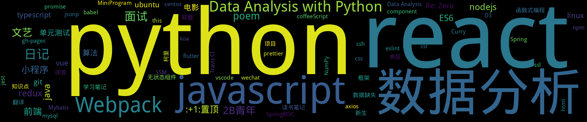

<p align='center'>
    
    
    
    
    
    
    
</p>
<p align='center'>
    <a href="https://visitor-badge.glitch.me/#docs">
        
    </a>
</p>

## 置顶 :thumbsup: 
- [网站工具Api搜集整理](https://github.com/lirawx/note/issues/78)  <sup>0 :speech_balloon:</sup>  	 
- [Flutter 学习整理](https://github.com/lirawx/note/issues/76)  <sup>1 :speech_balloon:</sup>  	 
## 最新 :new: 

#### [Redux 实现原理](https://github.com/lirawx/note/issues/94) <sup>0 :speech_balloon:</sup> 	 2020-05-12 16:27:43
:label: : [react](https://github.com/lirawx/note/labels/react), [redux](https://github.com/lirawx/note/labels/redux)
```javascript
function createStore(reducer, state = null){
    let listeners = [];
    let getState = () => state;
    let subscribe = listener =>
[更多>>>](https://github.com/lirawx/note/issues/94)
---

#### [ssl 生成 ssl 证书](https://github.com/lirawx/note/issues/93) <sup>0 :speech_balloon:</sup> 	 2020-05-12 15:30:58
:label: : [linux](https://github.com/lirawx/note/labels/linux), [ssl](https://github.com/lirawx/note/labels/ssl)
## nginx 安装
```
sudo apt get install nginx
```

nginx 配置
```
server {
    listen 80 default;
    server_name domain;
    location / {
     
[更多>>>](https://github.com/lirawx/note/issues/93)
---

#### [React 单元测试](https://github.com/lirawx/note/issues/92) <sup>0 :speech_balloon:</sup> 	 2019-09-16 08:17:22
:label: : [jest](https://github.com/lirawx/note/labels/jest), [react](https://github.com/lirawx/note/labels/react), [单元测试](https://github.com/lirawx/note/labels/%E5%8D%95%E5%85%83%E6%B5%8B%E8%AF%95)
## 为何必须做单元测试

* 单元测试对于任何 React 项目（及其他任何项目）来说都是必须的
* 我们需要自动化的测试套件，根本目标是支持随时随地的代码调整、持续改进，从而提升团队响应力
* 使用 TDD 开发是得到好的单元测试的唯一途径
* 好的单元测试具备几大特征：不关注内部实现
[更多>>>](https://github.com/lirawx/note/issues/92)
---

#### [如何炼就数据分析的思维？](https://github.com/lirawx/note/issues/91) <sup>0 :speech_balloon:</sup> 	 2019-08-23 13:59:38
:label: : [数据分析](https://github.com/lirawx/note/labels/%E6%95%B0%E6%8D%AE%E5%88%86%E6%9E%90)
## 一、结构化思维
《金字塔原理》

具体的操作方式是：

A. 尽可能列出所有思考的要点

B. 找出关系，进行分类。

他的原则是论点之间相互独立，不重叠；论据穷尽划分，不遗漏。

## 二、假说演绎思维

假设先行就是以假设作为思考的起点，先提出问题，然后用MECE
[更多>>>](https://github.com/lirawx/note/issues/91)
---

#### [数据分析惯用的5种思维方法](https://github.com/lirawx/note/issues/90) <sup>0 :speech_balloon:</sup> 	 2019-08-23 13:58:08
:label: : [数据分析](https://github.com/lirawx/note/labels/%E6%95%B0%E6%8D%AE%E5%88%86%E6%9E%90)
## 一、公式法

举例：分析某产品的销售额较低的原因，用公式法分解

某产品销售额=销售量 X 产品单价

销售量=渠道A销售量 + 渠道B销售量 + 渠道C销售量 + …

渠道销售量=点击用户数 X 下单率

点击用户数=曝光量 X 点击率


## 二、对比法

[更多>>>](https://github.com/lirawx/note/issues/90)
---

## 分类  :card_file_box: 
<details open="open">
    <summary>
        
        <p align="center">:cloud: 词云 :cloud: <sub>点击词云展开详细分类:point_down: </sub></p>
    </summary>

<details>
<summary>2B青年	<sup>4:newspaper:</sup></summary>
- [初爱](https://github.com/lirawx/note/issues/23)  <sup>0 :speech_balloon:</sup>  	 
- [关山月](https://github.com/lirawx/note/issues/22)  <sup>0 :speech_balloon:</sup>  	 
- [雪中歌](https://github.com/lirawx/note/issues/21)  <sup>0 :speech_balloon:</sup>  	 
- [江上有感](https://github.com/lirawx/note/issues/18)  <sup>0 :speech_balloon:</sup>  	 

</details>

<details>
<summary>:+1:置顶	<sup>2:newspaper:</sup></summary>
- [网站工具Api搜集整理](https://github.com/lirawx/note/issues/78)  <sup>0 :speech_balloon:</sup>  	 
- [Flutter 学习整理](https://github.com/lirawx/note/issues/76)  <sup>1 :speech_balloon:</sup>  	 

</details>

<details>
<summary>:framed_picture:封面	<sup>0:newspaper:</sup></summary>

</details>

<details>
<summary>Curry	<sup>1:newspaper:</sup></summary>
- [柯里化](https://github.com/lirawx/note/issues/29)  <sup>0 :speech_balloon:</sup>  	 

</details>

<details>
<summary>D3	<sup>1:newspaper:</sup></summary>
- [D3 与 React ](https://github.com/lirawx/note/issues/63)  <sup>0 :speech_balloon:</sup>  	 

</details>

<details>
<summary>Data Analysis	<sup>1:newspaper:</sup></summary>
- [Data Analysis with Python——01](https://github.com/lirawx/note/issues/75)  <sup>0 :speech_balloon:</sup>  	 

</details>

<details>
<summary>Data Analysis with Python	<sup>9:newspaper:</sup></summary>
- [Data Analysis with Python——09](https://github.com/lirawx/note/issues/89)  <sup>1 :speech_balloon:</sup>  	 
- [Data Analysis with Python——08](https://github.com/lirawx/note/issues/88)  <sup>0 :speech_balloon:</sup>  	 
- [Data Analysis with Python——07](https://github.com/lirawx/note/issues/87)  <sup>0 :speech_balloon:</sup>  	 
- [Data Analysis with Python——06](https://github.com/lirawx/note/issues/86)  <sup>0 :speech_balloon:</sup>  	 
- [Data Analysis with Python——05](https://github.com/lirawx/note/issues/85)  <sup>0 :speech_balloon:</sup>  	 
- [Data Analysis with Python——04](https://github.com/lirawx/note/issues/84)  <sup>0 :speech_balloon:</sup>  	 
- [Data Analysis with Python——03](https://github.com/lirawx/note/issues/83)  <sup>0 :speech_balloon:</sup>  	 
- [Data Analysis with Python——02](https://github.com/lirawx/note/issues/82)  <sup>0 :speech_balloon:</sup>  	 
- [Data Analysis with Python——01](https://github.com/lirawx/note/issues/81)  <sup>0 :speech_balloon:</sup>  	 

</details>

<details>
<summary>ES6	<sup>3:newspaper:</sup></summary>
- [ES6 数组去重](https://github.com/lirawx/note/issues/57)  <sup>0 :speech_balloon:</sup>  	 
- [ES6 知识点整理](https://github.com/lirawx/note/issues/34)  <sup>0 :speech_balloon:</sup>  	 
- [【译】ES 6 代理 (Proxy) 简介 ](https://github.com/lirawx/note/issues/32)  <sup>0 :speech_balloon:</sup>  	 

</details>

<details>
<summary>MiniProgram	<sup>1:newspaper:</sup></summary>
- [小程序ios 安卓兼容性](https://github.com/lirawx/note/issues/65)  <sup>0 :speech_balloon:</sup>  	 

</details>

<details>
<summary>Mybatis	<sup>1:newspaper:</sup></summary>
- [java SSM框架的搭建](https://github.com/lirawx/note/issues/25)  <sup>0 :speech_balloon:</sup>  	 

</details>

<details>
<summary>NumPy	<sup>1:newspaper:</sup></summary>
- [Data Analysis with Python——01](https://github.com/lirawx/note/issues/75)  <sup>0 :speech_balloon:</sup>  	 

</details>

<details>
<summary>Raspberry Pi	<sup>0:newspaper:</sup></summary>

</details>

<details>
<summary>Re: Zero	<sup>2:newspaper:</sup></summary>
- [Re: Zero JSX 回调函数中的 this](https://github.com/lirawx/note/issues/44)  <sup>0 :speech_balloon:</sup>  	 
- [## Re: Zero 学习一个组件](https://github.com/lirawx/note/issues/43)  <sup>0 :speech_balloon:</sup>  	 

</details>

<details>
<summary>SSM	<sup>1:newspaper:</sup></summary>
- [java SSM框架的搭建](https://github.com/lirawx/note/issues/25)  <sup>0 :speech_balloon:</sup>  	 

</details>

<details>
<summary>Spring	<sup>1:newspaper:</sup></summary>
- [java SSM框架的搭建](https://github.com/lirawx/note/issues/25)  <sup>0 :speech_balloon:</sup>  	 

</details>

<details>
<summary>SpringMVC	<sup>1:newspaper:</sup></summary>
- [java SSM框架的搭建](https://github.com/lirawx/note/issues/25)  <sup>0 :speech_balloon:</sup>  	 

</details>

<details>
<summary>Travis CI	<sup>1:newspaper:</sup></summary>
- [travis ci 持续集成](https://github.com/lirawx/note/issues/26)  <sup>0 :speech_balloon:</sup>  	 

</details>

<details>
<summary>Webpack	<sup>10:newspaper:</sup></summary>
- [webpack to umd package](https://github.com/lirawx/note/issues/72)  <sup>0 :speech_balloon:</sup>  	 
- [webpack 4 - webpack-merge to config dev prod environment quickly](https://github.com/lirawx/note/issues/71)  <sup>0 :speech_balloon:</sup>  	 
- [webpack4-HMR with webpack-dev-server](https://github.com/lirawx/note/issues/70)  <sup>0 :speech_balloon:</sup>  	 
- [webpack4-Atuo serve dist file](https://github.com/lirawx/note/issues/69)  <sup>0 :speech_balloon:</sup>  	 
- [# webpack4-command line without config file](https://github.com/lirawx/note/issues/68)  <sup>0 :speech_balloon:</sup>  	 
- [webpack4 - Basic config](https://github.com/lirawx/note/issues/67)  <sup>0 :speech_balloon:</sup>  	 
- [react webpack babel 三剑客错误处理](https://github.com/lirawx/note/issues/53)  <sup>0 :speech_balloon:</sup>  	 
- [webpack 3.5.5 文档 再读](https://github.com/lirawx/note/issues/52)  <sup>0 :speech_balloon:</sup>  	 
- [webpack 4 ](https://github.com/lirawx/note/issues/39)  <sup>0 :speech_balloon:</sup>  	 
- [Webpack 入门](https://github.com/lirawx/note/issues/11)  <sup>0 :speech_balloon:</sup>  	 

</details>

<details>
<summary>axios	<sup>1:newspaper:</sup></summary>
- [基于 Promise 的 HTTP 请求客户端，axios](https://github.com/lirawx/note/issues/13)  <sup>0 :speech_balloon:</sup>  	 

</details>

<details>
<summary>babel	<sup>1:newspaper:</sup></summary>
- [react webpack babel 三剑客错误处理](https://github.com/lirawx/note/issues/53)  <sup>0 :speech_balloon:</sup>  	 

</details>

<details>
<summary>bug	<sup>0:newspaper:</sup></summary>

</details>

<details>
<summary>centos	<sup>1:newspaper:</sup></summary>
- [ssh 权限问题](https://github.com/lirawx/note/issues/41)  <sup>0 :speech_balloon:</sup>  	 

</details>

<details>
<summary>coffeeScript	<sup>1:newspaper:</sup></summary>
- [CoffeeScript 基础知识](https://github.com/lirawx/note/issues/8)  <sup>0 :speech_balloon:</sup>  	 

</details>

<details>
<summary>component	<sup>1:newspaper:</sup></summary>
- [## Re: Zero 学习一个组件](https://github.com/lirawx/note/issues/43)  <sup>0 :speech_balloon:</sup>  	 

</details>

<details>
<summary>css	<sup>1:newspaper:</sup></summary>
- [前端开发，从草根到英雄(总结)](https://github.com/lirawx/note/issues/12)  <sup>0 :speech_balloon:</sup>  	 

</details>

<details>
<summary>duplicate	<sup>0:newspaper:</sup></summary>

</details>

<details>
<summary>enhancement	<sup>0:newspaper:</sup></summary>

</details>

<details>
<summary>eslint	<sup>1:newspaper:</sup></summary>
- [vscode AutoSave With Prettier ](https://github.com/lirawx/note/issues/64)  <sup>0 :speech_balloon:</sup>  	 

</details>

<details>
<summary>flutter	<sup>1:newspaper:</sup></summary>
- [Flutter 学习整理](https://github.com/lirawx/note/issues/76)  <sup>1 :speech_balloon:</sup>  	 

</details>

<details>
<summary>gh-pages	<sup>1:newspaper:</sup></summary>
- [travis ci 持续集成](https://github.com/lirawx/note/issues/26)  <sup>0 :speech_balloon:</sup>  	 

</details>

<details>
<summary>git	<sup>2:newspaper:</sup></summary>
- [travis ci 持续集成](https://github.com/lirawx/note/issues/26)  <sup>0 :speech_balloon:</sup>  	 
- [git 安装与使用](https://github.com/lirawx/note/issues/14)  <sup>0 :speech_balloon:</sup>  	 

</details>

<details>
<summary>help wanted	<sup>0:newspaper:</sup></summary>

</details>

<details>
<summary>html	<sup>1:newspaper:</sup></summary>
- [前端开发，从草根到英雄(总结)](https://github.com/lirawx/note/issues/12)  <sup>0 :speech_balloon:</sup>  	 

</details>

<details>
<summary>invalid	<sup>0:newspaper:</sup></summary>

</details>

<details>
<summary>java	<sup>3:newspaper:</sup></summary>
- [Oracle 与 MySql 区别(笔记)](https://github.com/lirawx/note/issues/6)  <sup>0 :speech_balloon:</sup>  	 
- [java基础知识笔记（2）](https://github.com/lirawx/note/issues/5)  <sup>0 :speech_balloon:</sup>  	 
- [java基础知识笔记（1）](https://github.com/lirawx/note/issues/4)  <sup>0 :speech_balloon:</sup>  	 

</details>

<details>
<summary>javascript	<sup>11:newspaper:</sup></summary>
- [前端常用算法梳理](https://github.com/lirawx/note/issues/77)  <sup>0 :speech_balloon:</sup>  	 
- [ES6 数组去重](https://github.com/lirawx/note/issues/57)  <sup>0 :speech_balloon:</sup>  	 
- [函数式编程](https://github.com/lirawx/note/issues/49)  <sup>0 :speech_balloon:</sup>  	 
- [javascript 转换](https://github.com/lirawx/note/issues/38)  <sup>0 :speech_balloon:</sup>  	 
- [算法](https://github.com/lirawx/note/issues/36)  <sup>0 :speech_balloon:</sup>  	 
- [this的指向](https://github.com/lirawx/note/issues/31)  <sup>0 :speech_balloon:</sup>  	 
- [闭包的应用](https://github.com/lirawx/note/issues/30)  <sup>0 :speech_balloon:</sup>  	 
- [手撸一个 redux 实现](https://github.com/lirawx/note/issues/28)  <sup>0 :speech_balloon:</sup>  	 
- [javascript 精粹](https://github.com/lirawx/note/issues/27)  <sup>0 :speech_balloon:</sup>  	 
- [基于 Promise 的 HTTP 请求客户端，axios](https://github.com/lirawx/note/issues/13)  <sup>0 :speech_balloon:</sup>  	 
- [前端开发，从草根到英雄(总结)](https://github.com/lirawx/note/issues/12)  <sup>0 :speech_balloon:</sup>  	 

</details>

<details>
<summary>jest	<sup>1:newspaper:</sup></summary>
- [React 单元测试](https://github.com/lirawx/note/issues/92)  <sup>0 :speech_balloon:</sup>  	 

</details>

<details>
<summary>jsonp	<sup>1:newspaper:</sup></summary>
- [Promise Jsonp](https://github.com/lirawx/note/issues/50)  <sup>0 :speech_balloon:</sup>  	 

</details>

<details>
<summary>koa	<sup>1:newspaper:</sup></summary>
- [Koa 中间件](https://github.com/lirawx/note/issues/60)  <sup>0 :speech_balloon:</sup>  	 

</details>

<details>
<summary>linux	<sup>2:newspaper:</sup></summary>
- [ssl 生成 ssl 证书](https://github.com/lirawx/note/issues/93)  <sup>0 :speech_balloon:</sup>  	 
- [Ubuntu安装BTSync](https://github.com/lirawx/note/issues/7)  <sup>1 :speech_balloon:</sup>  	 

</details>

<details>
<summary>mysql	<sup>1:newspaper:</sup></summary>
- [Mysql 备忘](https://github.com/lirawx/note/issues/45)  <sup>0 :speech_balloon:</sup>  	 

</details>

<details>
<summary>nodejs	<sup>3:newspaper:</sup></summary>
- [Promise Jsonp](https://github.com/lirawx/note/issues/50)  <sup>0 :speech_balloon:</sup>  	 
- [travis ci 持续集成](https://github.com/lirawx/note/issues/26)  <sup>0 :speech_balloon:</sup>  	 
- [基于 Promise 的 HTTP 请求客户端，axios](https://github.com/lirawx/note/issues/13)  <sup>0 :speech_balloon:</sup>  	 

</details>

<details>
<summary>npm	<sup>1:newspaper:</sup></summary>
- [publish package to npmjs.com](https://github.com/lirawx/note/issues/66)  <sup>0 :speech_balloon:</sup>  	 

</details>

<details>
<summary>poem	<sup>4:newspaper:</sup></summary>
- [初爱](https://github.com/lirawx/note/issues/23)  <sup>0 :speech_balloon:</sup>  	 
- [关山月](https://github.com/lirawx/note/issues/22)  <sup>0 :speech_balloon:</sup>  	 
- [雪中歌](https://github.com/lirawx/note/issues/21)  <sup>0 :speech_balloon:</sup>  	 
- [江上有感](https://github.com/lirawx/note/issues/18)  <sup>0 :speech_balloon:</sup>  	 

</details>

<details>
<summary>prettier	<sup>1:newspaper:</sup></summary>
- [vscode AutoSave With Prettier ](https://github.com/lirawx/note/issues/64)  <sup>0 :speech_balloon:</sup>  	 

</details>

<details>
<summary>promise	<sup>1:newspaper:</sup></summary>
- [基于 Promise 的 HTTP 请求客户端，axios](https://github.com/lirawx/note/issues/13)  <sup>0 :speech_balloon:</sup>  	 

</details>

<details>
<summary>python	<sup>14:newspaper:</sup></summary>
- [Data Analysis with Python——09](https://github.com/lirawx/note/issues/89)  <sup>1 :speech_balloon:</sup>  	 
- [Data Analysis with Python——08](https://github.com/lirawx/note/issues/88)  <sup>0 :speech_balloon:</sup>  	 
- [Data Analysis with Python——07](https://github.com/lirawx/note/issues/87)  <sup>0 :speech_balloon:</sup>  	 
- [Data Analysis with Python——06](https://github.com/lirawx/note/issues/86)  <sup>0 :speech_balloon:</sup>  	 
- [Data Analysis with Python——05](https://github.com/lirawx/note/issues/85)  <sup>0 :speech_balloon:</sup>  	 
- [Data Analysis with Python——04](https://github.com/lirawx/note/issues/84)  <sup>0 :speech_balloon:</sup>  	 
- [Data Analysis with Python——03](https://github.com/lirawx/note/issues/83)  <sup>0 :speech_balloon:</sup>  	 
- [Data Analysis with Python——02](https://github.com/lirawx/note/issues/82)  <sup>0 :speech_balloon:</sup>  	 
- [Data Analysis with Python——01](https://github.com/lirawx/note/issues/81)  <sup>0 :speech_balloon:</sup>  	 
- [python数据分析之性能度量](https://github.com/lirawx/note/issues/80)  <sup>0 :speech_balloon:</sup>  	 
- [python数据分析之数据缺失](https://github.com/lirawx/note/issues/79)  <sup>0 :speech_balloon:</sup>  	 
- [Data Analysis with Python——01](https://github.com/lirawx/note/issues/75)  <sup>0 :speech_balloon:</sup>  	 
- [python 环境](https://github.com/lirawx/note/issues/74)  <sup>0 :speech_balloon:</sup>  	 
- [python之pyenv版本控制](https://github.com/lirawx/note/issues/15)  <sup>0 :speech_balloon:</sup>  	 

</details>

<details>
<summary>question	<sup>0:newspaper:</sup></summary>

</details>

<details>
<summary>react	<sup>14:newspaper:</sup></summary>
- [Redux 实现原理](https://github.com/lirawx/note/issues/94)  <sup>0 :speech_balloon:</sup>  	 
- [React 单元测试](https://github.com/lirawx/note/issues/92)  <sup>0 :speech_balloon:</sup>  	 
- [D3 与 React ](https://github.com/lirawx/note/issues/63)  <sup>0 :speech_balloon:</sup>  	 
- [React 单元测试](https://github.com/lirawx/note/issues/62)  <sup>0 :speech_balloon:</sup>  	 
- [React 服务端渲染](https://github.com/lirawx/note/issues/61)  <sup>0 :speech_balloon:</sup>  	 
- [redux 写法详解](https://github.com/lirawx/note/issues/59)  <sup>0 :speech_balloon:</sup>  	 
- [react webpack babel 三剑客错误处理](https://github.com/lirawx/note/issues/53)  <sup>0 :speech_balloon:</sup>  	 
- [一个可用于生产环境的开发框架的搭建](https://github.com/lirawx/note/issues/48)  <sup>0 :speech_balloon:</sup>  	 
- [项目结构详解](https://github.com/lirawx/note/issues/47)  <sup>0 :speech_balloon:</sup>  	 
- [Re: Zero JSX 回调函数中的 this](https://github.com/lirawx/note/issues/44)  <sup>0 :speech_balloon:</sup>  	 
- [## Re: Zero 学习一个组件](https://github.com/lirawx/note/issues/43)  <sup>0 :speech_balloon:</sup>  	 
- [无状态函数式组件](https://github.com/lirawx/note/issues/37)  <sup>0 :speech_balloon:</sup>  	 
- [面试纪要](https://github.com/lirawx/note/issues/33)  <sup>0 :speech_balloon:</sup>  	 
- [手撸一个 redux 实现](https://github.com/lirawx/note/issues/28)  <sup>0 :speech_balloon:</sup>  	 

</details>

<details>
<summary>redux	<sup>3:newspaper:</sup></summary>
- [Redux 实现原理](https://github.com/lirawx/note/issues/94)  <sup>0 :speech_balloon:</sup>  	 
- [redux 写法详解](https://github.com/lirawx/note/issues/59)  <sup>0 :speech_balloon:</sup>  	 
- [手撸一个 redux 实现](https://github.com/lirawx/note/issues/28)  <sup>0 :speech_balloon:</sup>  	 

</details>

<details>
<summary>ssh	<sup>1:newspaper:</sup></summary>
- [ssh 权限问题](https://github.com/lirawx/note/issues/41)  <sup>0 :speech_balloon:</sup>  	 

</details>

<details>
<summary>ssl	<sup>1:newspaper:</sup></summary>
- [ssl 生成 ssl 证书](https://github.com/lirawx/note/issues/93)  <sup>0 :speech_balloon:</sup>  	 

</details>

<details>
<summary>ssr	<sup>1:newspaper:</sup></summary>
- [React 服务端渲染](https://github.com/lirawx/note/issues/61)  <sup>0 :speech_balloon:</sup>  	 

</details>

<details>
<summary>this	<sup>1:newspaper:</sup></summary>
- [this的指向](https://github.com/lirawx/note/issues/31)  <sup>0 :speech_balloon:</sup>  	 

</details>

<details>
<summary>typescript	<sup>1:newspaper:</sup></summary>
- [vue with typescript](https://github.com/lirawx/note/issues/73)  <sup>0 :speech_balloon:</sup>  	 

</details>

<details>
<summary>ubuntu	<sup>2:newspaper:</sup></summary>
- [Ubuntu使用dnsmasq作本地DNS缓存](https://github.com/lirawx/note/issues/24)  <sup>0 :speech_balloon:</sup>  	 
- [Ubuntu安装BTSync](https://github.com/lirawx/note/issues/7)  <sup>1 :speech_balloon:</sup>  	 

</details>

<details>
<summary>vscode	<sup>1:newspaper:</sup></summary>
- [vscode AutoSave With Prettier ](https://github.com/lirawx/note/issues/64)  <sup>0 :speech_balloon:</sup>  	 

</details>

<details>
<summary>vue	<sup>2:newspaper:</sup></summary>
- [vue with typescript](https://github.com/lirawx/note/issues/73)  <sup>0 :speech_balloon:</sup>  	 
- [vue全面介绍--全家桶（vue笔记一）](https://github.com/lirawx/note/issues/10)  <sup>0 :speech_balloon:</sup>  	 

</details>

<details>
<summary>wechat	<sup>1:newspaper:</sup></summary>
- [小程序ios 安卓兼容性](https://github.com/lirawx/note/issues/65)  <sup>0 :speech_balloon:</sup>  	 

</details>

<details>
<summary>wontfix	<sup>0:newspaper:</sup></summary>

</details>

<details>
<summary>函数式编程	<sup>1:newspaper:</sup></summary>
- [函数式编程](https://github.com/lirawx/note/issues/49)  <sup>0 :speech_balloon:</sup>  	 

</details>

<details>
<summary>前端	<sup>2:newspaper:</sup></summary>
- [前端常用算法梳理](https://github.com/lirawx/note/issues/77)  <sup>0 :speech_balloon:</sup>  	 
- [柯里化](https://github.com/lirawx/note/issues/29)  <sup>0 :speech_balloon:</sup>  	 

</details>

<details>
<summary>单元测试	<sup>2:newspaper:</sup></summary>
- [React 单元测试](https://github.com/lirawx/note/issues/92)  <sup>0 :speech_balloon:</sup>  	 
- [React 单元测试](https://github.com/lirawx/note/issues/62)  <sup>0 :speech_balloon:</sup>  	 

</details>

<details>
<summary>取整	<sup>1:newspaper:</sup></summary>
- [javascript 转换](https://github.com/lirawx/note/issues/38)  <sup>0 :speech_balloon:</sup>  	 

</details>

<details>
<summary>学习笔记	<sup>1:newspaper:</sup></summary>
- [javascript 精粹](https://github.com/lirawx/note/issues/27)  <sup>0 :speech_balloon:</sup>  	 

</details>

<details>
<summary>小程序	<sup>3:newspaper:</sup></summary>
- [小程序热区](https://github.com/lirawx/note/issues/58)  <sup>0 :speech_balloon:</sup>  	 
- [小程序组件及组件事件转发](https://github.com/lirawx/note/issues/56)  <sup>0 :speech_balloon:</sup>  	 
- [小程序热区](https://github.com/lirawx/note/issues/55)  <sup>0 :speech_balloon:</sup>  	 

</details>

<details>
<summary>开源	<sup>0:newspaper:</sup></summary>

</details>

<details>
<summary>技术	<sup>0:newspaper:</sup></summary>

</details>

<details>
<summary>数据分析	<sup>13:newspaper:</sup></summary>
- [如何炼就数据分析的思维？](https://github.com/lirawx/note/issues/91)  <sup>0 :speech_balloon:</sup>  	 
- [数据分析惯用的5种思维方法](https://github.com/lirawx/note/issues/90)  <sup>0 :speech_balloon:</sup>  	 
- [Data Analysis with Python——09](https://github.com/lirawx/note/issues/89)  <sup>1 :speech_balloon:</sup>  	 
- [Data Analysis with Python——08](https://github.com/lirawx/note/issues/88)  <sup>0 :speech_balloon:</sup>  	 
- [Data Analysis with Python——07](https://github.com/lirawx/note/issues/87)  <sup>0 :speech_balloon:</sup>  	 
- [Data Analysis with Python——06](https://github.com/lirawx/note/issues/86)  <sup>0 :speech_balloon:</sup>  	 
- [Data Analysis with Python——05](https://github.com/lirawx/note/issues/85)  <sup>0 :speech_balloon:</sup>  	 
- [Data Analysis with Python——04](https://github.com/lirawx/note/issues/84)  <sup>0 :speech_balloon:</sup>  	 
- [Data Analysis with Python——03](https://github.com/lirawx/note/issues/83)  <sup>0 :speech_balloon:</sup>  	 
- [Data Analysis with Python——02](https://github.com/lirawx/note/issues/82)  <sup>0 :speech_balloon:</sup>  	 
- [Data Analysis with Python——01](https://github.com/lirawx/note/issues/81)  <sup>0 :speech_balloon:</sup>  	 
- [python数据分析之性能度量](https://github.com/lirawx/note/issues/80)  <sup>0 :speech_balloon:</sup>  	 
- [python数据分析之数据缺失](https://github.com/lirawx/note/issues/79)  <sup>0 :speech_balloon:</sup>  	 

</details>

<details>
<summary>数据缺失	<sup>1:newspaper:</sup></summary>
- [python数据分析之数据缺失](https://github.com/lirawx/note/issues/79)  <sup>0 :speech_balloon:</sup>  	 

</details>

<details>
<summary>文艺	<sup>4:newspaper:</sup></summary>
- [初爱](https://github.com/lirawx/note/issues/23)  <sup>0 :speech_balloon:</sup>  	 
- [关山月](https://github.com/lirawx/note/issues/22)  <sup>0 :speech_balloon:</sup>  	 
- [雪中歌](https://github.com/lirawx/note/issues/21)  <sup>0 :speech_balloon:</sup>  	 
- [江上有感](https://github.com/lirawx/note/issues/18)  <sup>0 :speech_balloon:</sup>  	 

</details>

<details>
<summary>新生	<sup>1:newspaper:</sup></summary>
- [拿到公司电脑，之后要做些什么](https://github.com/lirawx/note/issues/46)  <sup>0 :speech_balloon:</sup>  	 

</details>

<details>
<summary>无状态组件	<sup>1:newspaper:</sup></summary>
- [无状态函数式组件](https://github.com/lirawx/note/issues/37)  <sup>0 :speech_balloon:</sup>  	 

</details>

<details>
<summary>日记	<sup>6:newspaper:</sup></summary>
- [对未来的思考](https://github.com/lirawx/note/issues/20)  <sup>0 :speech_balloon:</sup>  	 
- [谁说的青春无悔](https://github.com/lirawx/note/issues/19)  <sup>0 :speech_balloon:</sup>  	 
- [生活，需要一些仪式感 ](https://github.com/lirawx/note/issues/17)  <sup>0 :speech_balloon:</sup>  	 
- [2015-09-08-反思](https://github.com/lirawx/note/issues/16)  <sup>0 :speech_balloon:</sup>  	 
- [2017-05-19-总结](https://github.com/lirawx/note/issues/3)  <sup>0 :speech_balloon:</sup>  	 
- [热爱工作热爱生活](https://github.com/lirawx/note/issues/2)  <sup>0 :speech_balloon:</sup>  	 

</details>

<details>
<summary>柯里	<sup>1:newspaper:</sup></summary>
- [柯里化](https://github.com/lirawx/note/issues/29)  <sup>0 :speech_balloon:</sup>  	 

</details>

<details>
<summary>框架	<sup>1:newspaper:</sup></summary>
- [一个可用于生产环境的开发框架的搭建](https://github.com/lirawx/note/issues/48)  <sup>0 :speech_balloon:</sup>  	 

</details>

<details>
<summary>热区	<sup>1:newspaper:</sup></summary>
- [小程序热区](https://github.com/lirawx/note/issues/55)  <sup>0 :speech_balloon:</sup>  	 

</details>

<details>
<summary>电影	<sup>2:newspaper:</sup></summary>
- [无问西东](https://github.com/lirawx/note/issues/51)  <sup>0 :speech_balloon:</sup>  	 
- [姜文的一步之遥](https://github.com/lirawx/note/issues/9)  <sup>0 :speech_balloon:</sup>  	 

</details>

<details>
<summary>知识点	<sup>1:newspaper:</sup></summary>
- [ES6 知识点整理](https://github.com/lirawx/note/issues/34)  <sup>0 :speech_balloon:</sup>  	 

</details>

<details>
<summary>算法	<sup>2:newspaper:</sup></summary>
- [前端常用算法梳理](https://github.com/lirawx/note/issues/77)  <sup>0 :speech_balloon:</sup>  	 
- [算法](https://github.com/lirawx/note/issues/36)  <sup>0 :speech_balloon:</sup>  	 

</details>

<details>
<summary>翻译	<sup>1:newspaper:</sup></summary>
- [【译】ES 6 代理 (Proxy) 简介 ](https://github.com/lirawx/note/issues/32)  <sup>0 :speech_balloon:</sup>  	 

</details>

<details>
<summary>读书笔记	<sup>1:newspaper:</sup></summary>
- [生活，需要一些仪式感 ](https://github.com/lirawx/note/issues/17)  <sup>0 :speech_balloon:</sup>  	 

</details>

<details>
<summary>闭包	<sup>1:newspaper:</sup></summary>
- [闭包的应用](https://github.com/lirawx/note/issues/30)  <sup>0 :speech_balloon:</sup>  	 

</details>

<details>
<summary>面试	<sup>3:newspaper:</sup></summary>
- [面试纪要](https://github.com/lirawx/note/issues/33)  <sup>0 :speech_balloon:</sup>  	 
- [this的指向](https://github.com/lirawx/note/issues/31)  <sup>0 :speech_balloon:</sup>  	 
- [柯里化](https://github.com/lirawx/note/issues/29)  <sup>0 :speech_balloon:</sup>  	 

</details>

<details>
<summary>音乐	<sup>0:newspaper:</sup></summary>

</details>

<details>
<summary>项目	<sup>1:newspaper:</sup></summary>
- [项目结构详解](https://github.com/lirawx/note/issues/47)  <sup>0 :speech_balloon:</sup>  	 

</details>

</details>    
